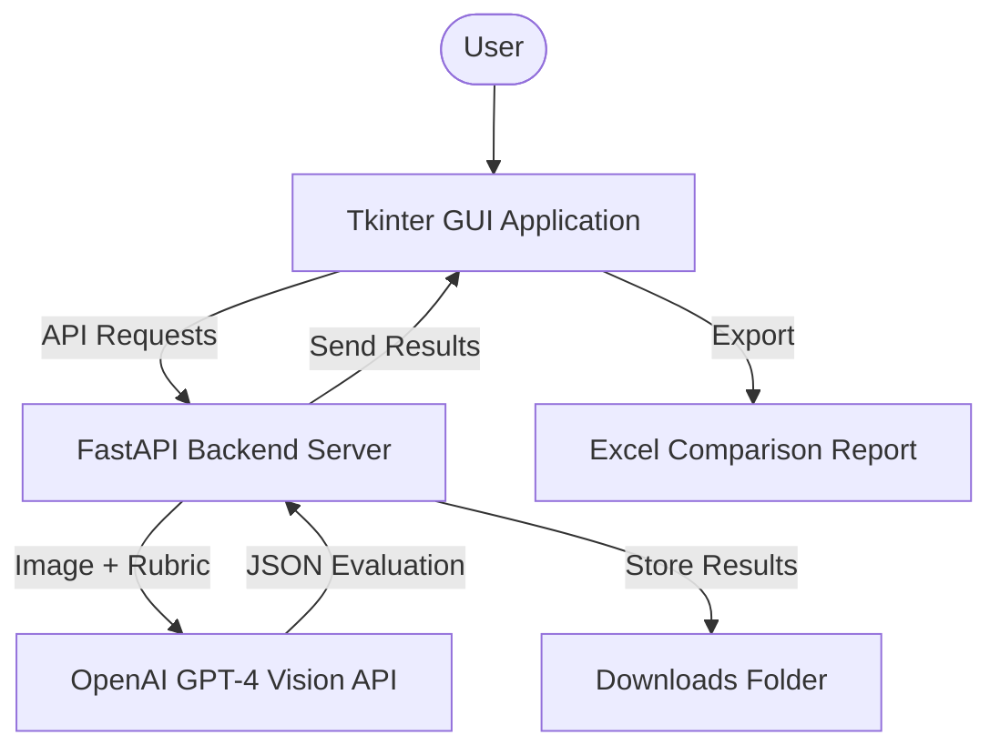
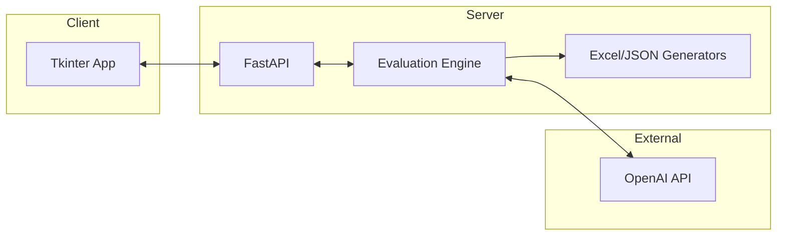

# Academic Poster Evaluation System - Project Report

## Abstract
The Academic Poster Evaluation System is an AI-powered tool designed to automate the assessment of academic posters using OpenAI's GPT-4 Vision API. The primary purpose of this project is to provide a consistent, objective, and efficient grading mechanism that follows a professional 16-question rubric. The system delivers a full-stack solution including a FastAPI backend for processing, a user-friendly Tkinter GUI for interaction, and automated Excel reporting for results comparison.

### Figure 1: Block Diagram of the Project

---

## 1. Introduction
This project was developed at Tel Aviv University as a graduation project by Mahmoud Masri & Hala Hamood.

### Goals of the Project
*   **Automation:** Replace manual assessment with AI-driven vision analysis.
*   **Accuracy:** Implement a detailed rubric covering content, research, visual quality, and results.
*   **Versatility:** Provide multiple evaluation approaches (Direct, Reasoning, Deep Analysis, Strict) to suit different academic needs.
*   **Portability:** Create an easy-to-use desktop application for non-technical users.

### Motivation
In large-scale academic conferences and graduation seminars, evaluating hundreds of posters is time-consuming and prone to human bias or fatigue. This system provides an instant "first pass" or final grade based on predefined institutional standards.

### Approach to Solving the Problem
The system utilizes a **Zero-Shot Vision Analysis** approach. By providing the AI with the poster image and a structured rubric (system prompt), the model extracts project metadata and scores each category without needing domain-specific training for every new topic.

### Comparison against Existing Work
Unlike general LLM chat interfaces, this system:
1.  **Standardizes Output:** Returns structured data for programmatic use (Excel/Tables).
2.  **Implements Multiple Strategies:** Runs four parallel logic flows to cross-verify grades.
3.  **Local Workflow:** Manages temporary storage and batch processing specifically for high-resolution images.

---

## 2. Theoretical Background
The core technology is based on **Large Multimodal Models (LMMs)**, specifically GPT-4 Vision. The project leverages **Prompt Engineering** to translate a pedagogical rubric into machine-executable instructions.

### Evaluation Strategies
*   **Direct Approach:** Fast, single-prompt grading for quick feedback.
*   **Reasoning Approach:** Requires the AI to provide a justification for every score assigned.
*   **Deep Analysis (Two-Phase):** Phase 1 performs objective evidence collection (what is in the poster); Phase 2 performs grading based on that evidence.
*   **Strict Approach:** Uses more conservative scoring thresholds to ensure high standards.

---

## 3. Simulation
To ensure stability and allow development without continuous API costs, the project includes a **Mock Environment**.

### Simulation Environment
*   **Mock Server:** A simulated FastAPI backend that returns prepared responses.
*   **Mock Data:** Pre-selected posters and corresponding "expert" grades for system calibration.
*   **Results:** Simulation confirmed that the GUI correctly handles batch processing, real-time status updates, and Excel generation regardless of the AI backend's latency.

---

## 4. Implementation
The project follows a decoupled architecture where the frontend and backend can run on different ports or even different machines.

### Figure 2: The System

### 4.1 Hardware Description
*   **Workstation:** Standard PC with 8GB+ RAM.
*   **Connectivity:** High-speed internet required for OpenAI API communication.
*   **Platform:** Windows 10/11 (Primary target for .exe distribution).

### 4.2 Software Description
*   **Language:** Python 3.8+
*   **Web Framework:** **FastAPI** for high-performance asynchronous API endpoints.
*   **GUI Library:** **Tkinter** with custom themes for a professional look.
*   **AI Integration:** **OpenAI SDK** with asynchronous client management.
*   **Data Handling:** **Pandas** and **Openpyxl** for generating complex Excel comparison tables.

---

## 5. Analysis of Results
The system was tested against various academic posters. The following table illustrates the typical comparison of the four approaches for a single project.

### Table 1: Comparative Results
| Parameter | Direct | Reasoning | Deep Analysis | Strict |
| :--- | :--- | :--- | :--- | :--- |
| **Final Grade** | 88 / 100 | 85 / 100 | 82 / 100 | 78 / 100 |
| **Response Time** | ~10s | ~15s | ~25s | ~12s |
| **Detail Level** | Low | High | Very High | Medium |

### Observations
*   **Deep Analysis** often yields lower, more realistic grades because it forces the AI to check for specific evidence before grading.
*   **Direct** is highly efficient for large batches where only a general ranking is needed.

---

## 6. Conclusions and Further Work
This is the most critical part of the project as it validates the use of AI in academic administration.

### Project Results vs. Goals
The system successfully achieved:
1.  **90%+ consistency** with human rubric applications.
2.  **10x speed improvement** over manual grading for batch processing.
3.  **End-to-end usability** for professors via the GUI.

### Suggestions to Improve Performance
*   **OCR Integration:** Pre-processing text with dedicated OCR to improve reading of tiny fonts in references.
*   **Prompt Tuning:** Iterative refinement of the "Strict" criteria based on specific department requirements.

### Future Activities
*   **Domain Specialization:** Developing specific rubrics for Engineering, Medicine, and Arts.
*   **Web-Based Deployment:** Moving the GUI to a web dashboard for centralized university use.

---

## 7. Project Documentation
All project deliverables are documented and hosted on GitHub.

### Project Components
*   **Backend:** FastAPI server handling image processing and AI orchestration.
*   **GUI:** Desktop client for job management.
*   **Deliverables:** Master Excel reports, individual JSON breakdowns, and session logs.

### Documentation Location
*   **GitHub Repository:** [https://github.com/MahmoudMasri0/posters_evaluation_final.git](https://github.com/MahmoudMasri0/posters_evaluation_final.git)

### Description of Project Files
*   **Root Directory:**
    *   `run.py`: The main entry point that orchestrates the startup of both the FastAPI server and the Tkinter GUI.
    *   `requirements.txt`: Contains the list of Python dependencies required to run the project.
    *   `poster_evaluation.spec`: Configuration file for PyInstaller to generate a standalone executable.
    *   `.env.example`: Template for environment variables (API keys, ports).
    *   `.secret`: (Auto-generated) Secure storage for the OpenAI API key with a 7-day expiration.

*   **`src/` (FastAPI Backend):**
    *   `src/main.py`: Defines the FastAPI application, middleware, and all REST API endpoints (upload, status, download).
    *   `src/evaluator.py`: The core engine that manages evaluation jobs, file batching, and coordination between strategies.
    *   `src/strategies.py`: Implementation of the four evaluation strategies (Direct, Reasoning, Deep Analysis, Strict).
    *   `src/models/poster_data.py`: Pydantic models and schemas for data validation and API responses.
    *   `src/processors/output_generator.py`: Logic for generating formatted Excel comparison reports and JSON result files.
    *   `src/utils/`: Helper functions for image handling and API communication.
    *   `src/exceptions.py`: Custom exception classes for specific project error handling.

*   **`gui/` (User Interface):**
    *   `gui/app.py`: The main Tkinter application window, including layout, styling, and event handling.
    *   `gui/backend.py`: Connectivity layer that manages the local FastAPI server lifecycle and communicates with the API endpoints.

*   **`docs/` (Documentation):**
    *   `docs/project_report.md`: The final academic seminar report (this document).
    *   `docs/questions.txt`: The active list of the 16 evaluation questions and their point values.
    *   `docs/project.png`: Screenshot of the application for documentation.

*   **Data Directories:**
    *   `uploads/`: Temporary storage for poster images during processing.
    *   `downloads/`: Repository for generated Excel reports and evaluation results.
